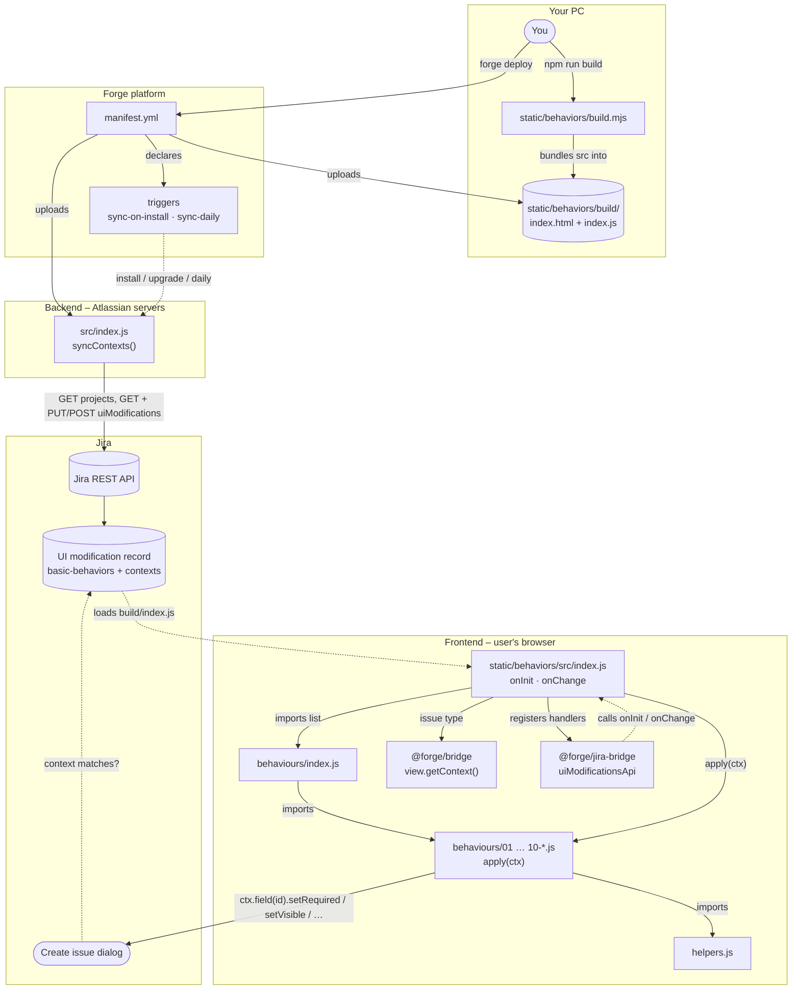
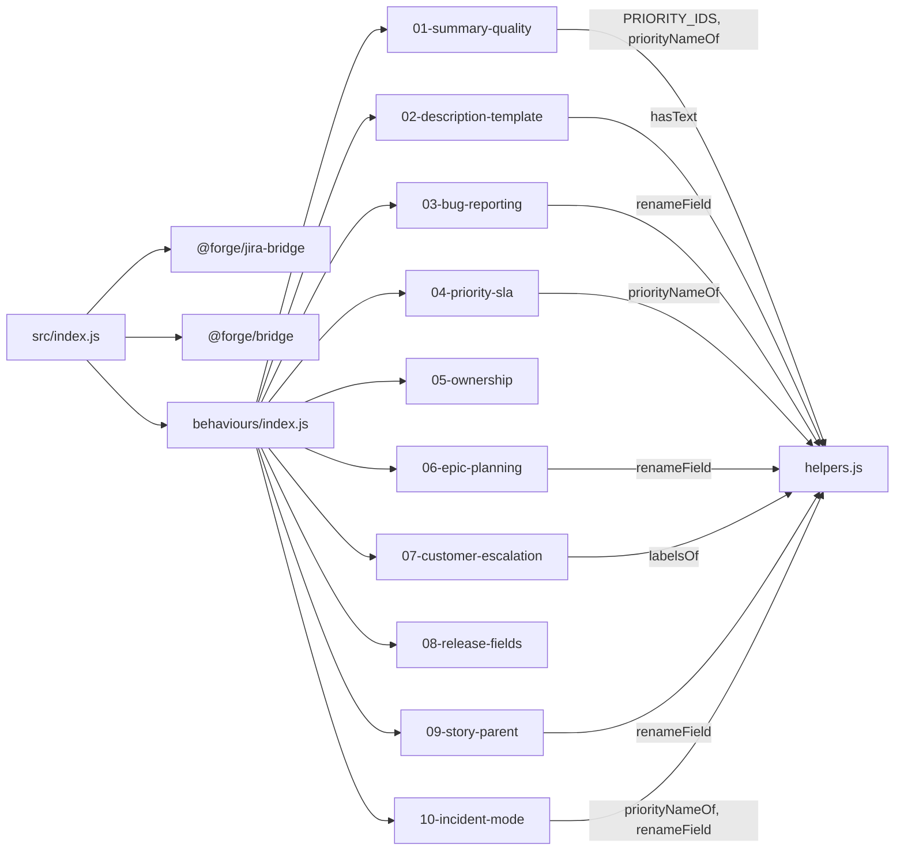
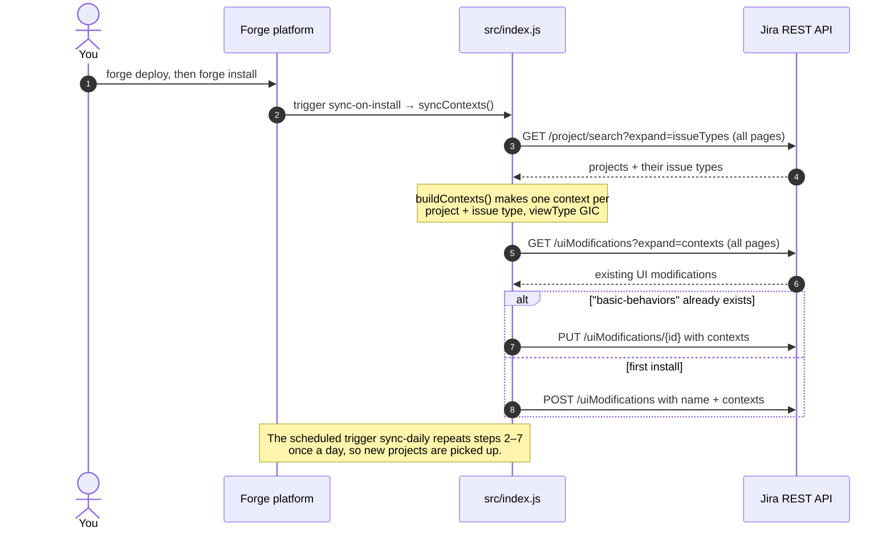
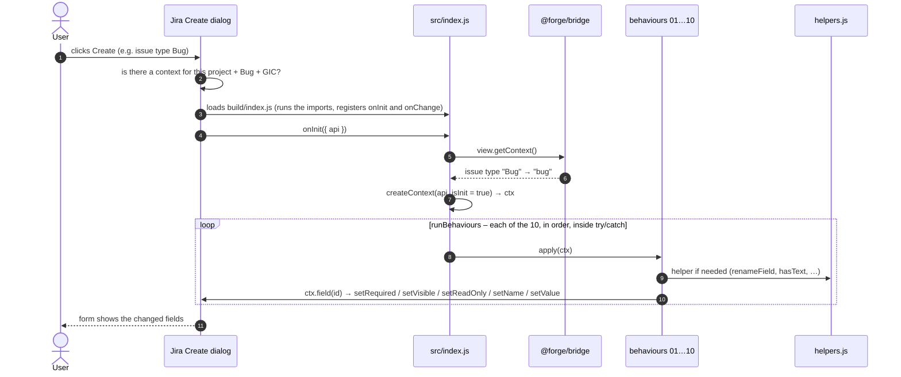
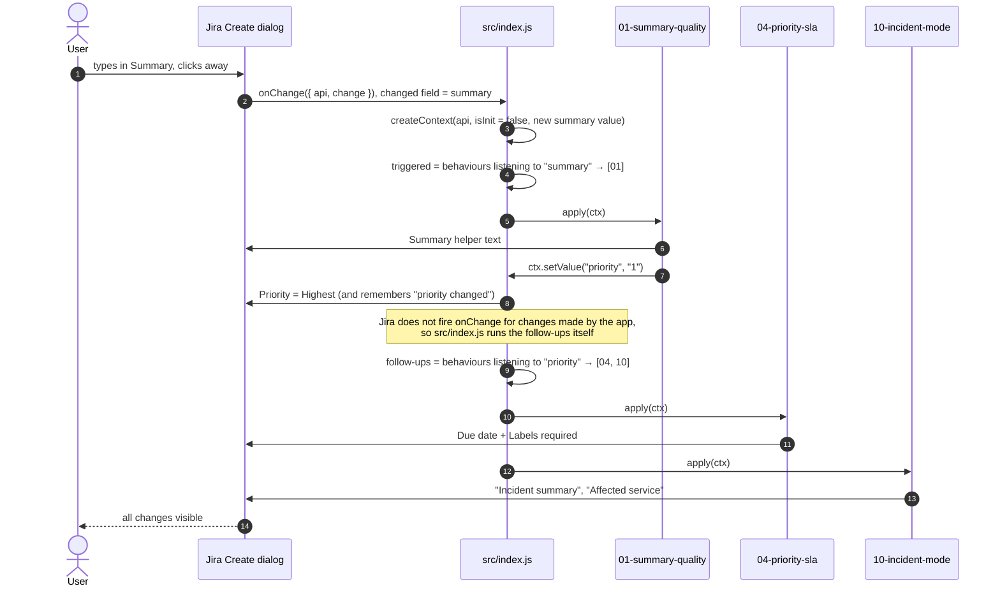

# How it works – a beginner's guide

This guide explains, in plain language, **what every file is for** and **which file calls which**,
by following real examples step by step. No Forge knowledge needed.

For a shorter reference, see [ARCHITECTURE.md](ARCHITECTURE.md). To add a new behaviour, see [ADDING-A-BEHAVIOUR.md](ADDING-A-BEHAVIOUR.md).

---

## 1. The one-minute version

The app is like ScriptRunner Behaviours: when someone opens **Create issue** in Jira,
fields change by themselves (hidden, renamed, required, read-only, pre-filled).

The code runs in **two different places**:

| Where | Folder | When it runs | Job |
|---|---|---|---|
| **Atlassian's servers** (backend) | `src/` | On install, on upgrade, once a day | Tells Jira **where** the behaviours apply (which projects / issue types / screens) |
| **The user's browser** (frontend) | `static/behaviors/` | Every time someone opens Create issue | Decides **what** happens to the fields |

They never call each other directly. The backend writes a setting into Jira; Jira reads that
setting and loads the frontend.

```
   BACKEND (Atlassian servers)                 JIRA                      FRONTEND (browser)
 ┌────────────────────────────┐        ┌───────────────────┐       ┌──────────────────────────┐
 │ src/index.js               │ saves  │ UI modification   │ loads │ static/behaviors/build/  │
 │ syncContexts()             │ ─────► │ "basic-behaviors" │ ────► │ index.js                 │
 │                            │        │ + contexts        │       │ (your 10 behaviours)     │
 └────────────────────────────┘        └───────────────────┘       └──────────────────────────┘
```

---

## 2. Words you will see

| Word | Meaning |
|---|---|
| **Forge** | Atlassian's platform for building Jira/Confluence apps. Your code runs on Atlassian's servers. |
| **UI modification** | Forge's name for a Behaviour. Lets an app change fields on Jira screens. |
| **Context** | One "place" a UI modification runs: *project + issue type + screen*. |
| **`GIC`** | "Global Issue Create" – the **Create issue** dialog. The only screen this app uses. |
| **Module** | One feature of the app, declared in `manifest.yml` (e.g. the UI modification, a trigger). |
| **Resource** | A folder of browser files that Forge hosts (here: `static/behaviors/build`). |
| **Scope** | A permission the app asks for (e.g. `read:jira-work`). |
| **Trigger** | "Run this function when something happens" (e.g. app installed). |
| **`onInit`** | Function Jira calls when the Create form **opens**. |
| **`onChange`** | Function Jira calls when the user **changes a field**. |
| **`ctx`** | The "toolbox" object our code hands to every behaviour. |
| **ADF** | Atlassian Document Format – the JSON used by the rich-text Description editor. |
| **Bundle / build** | All frontend files squashed into one file (`build/index.js`) for the browser. |

---

## 3. Every file, in plain words

For each file: **what it is**, **who uses it**, and **what it uses**.

### `manifest.yml` – the app's ID card

- **What:** A list of everything the app contains and is allowed to do.
- **Used by:** the `forge deploy` command and Jira.
- **Points to:** `src/index.js` (the `sync` function) and `static/behaviors/build` (the browser code).

It says, in short:

```
"I have a Behaviour (UI modification) whose code lives in static/behaviors/build.
 I have a function 'sync' = src/index.js → syncContexts.
 Run 'sync' when I'm installed or upgraded, and once a day.
 I need permission to read/write Jira work and manage Jira configuration."
```

### `package.json` + `package-lock.json` (root) – backend shopping list

- **What:** The npm packages the backend needs. Only `@forge/api` (to call Jira's REST API).
- **Used by:** `npm install` and `forge deploy`.

### `src/index.js` – the backend "setup" code

- **What:** Tells Jira "run my Behaviours on the Create screen for every project and issue type".
- **Called by:** Forge, via the triggers in `manifest.yml` (install, upgrade, daily).
- **Calls:** Jira's REST API.

Inside it, the functions call each other like this:

```
syncContexts()                         ← Forge calls this one
 ├── buildContexts()
 │     └── getAllPages()  ──► jira() ──► GET /rest/api/3/project/search   (all projects + issue types)
 ├── findExisting()
 │     └── getAllPages()  ──► jira() ──► GET /rest/api/3/uiModifications  (is our record already there?)
 └── jira()  ──►  PUT  /rest/api/3/uiModifications/{id}   (update it)
           or ──►  POST /rest/api/3/uiModifications       (create it the first time)
```

### `static/behaviors/package.json` – frontend shopping list

- **What:** Packages the browser code needs:
  - `@forge/jira-bridge` → gives us `onInit`, `onChange` and the fields.
  - `@forge/bridge` → gives us `view.getContext()` (to know the issue type).
  - `esbuild` → the tool that builds the bundle.
- **Defines the command** `npm run build`, which runs `build.mjs`.

### `static/behaviors/build.mjs` – the packer

- **What:** Squashes all the frontend files into **one** file, `build/index.js`, and makes `build/index.html`.
- **Called by:** you, through `npm run build`.
- **Why it matters:** Forge uploads `build/`, **not** `src/`. If you forget to build, Jira keeps running the old code.

```
src/index.js ─┐
src/helpers.js ┤
behaviours/*.js┼──► esbuild ──► build/index.js
               │
public/index.html ──► copied ──► build/index.html  (+ <script src="./index.js">)
```

### `static/behaviors/public/index.html` – the empty page

- **What:** A blank web page. Jira loads it invisibly; its only job is to run `index.js`.
- Nobody ever sees it.

### `static/behaviors/src/index.js` – the switchboard

- **What:** Connects Jira to the 10 behaviours. Contains **no rules** itself.
- **Called by:** Jira (it calls the `onInit` and `onChange` functions registered here).
- **Calls:** `behaviours/index.js` (to get the list), `view.getContext()`, and each behaviour's `apply(ctx)`.

Its parts:

| Part | What it does |
|---|---|
| `ALL_FIELDS` | Collects every field any behaviour uses, so Jira lets us touch them. |
| `readIssueType()` | Asks Forge "what issue type is selected?" → e.g. `"bug"`. |
| `createContext()` | Builds the `ctx` toolbox handed to each behaviour. |
| `runBehaviours()` | Runs a list of behaviours one by one; if one crashes, the rest still run. |
| `onInit(...)` | "When the form opens → run **all** behaviours." |
| `onChange(...)` | "When a field changes → run only the behaviours that care about that field." |

### `static/behaviors/src/behaviours/index.js` – the menu

- **What:** The list of all behaviours, in the order they run.
- **Called by:** `src/index.js` (imports the list).
- **Calls:** imports the 10 behaviour files.
- **Also contains:** the *ownership table* – which behaviour is allowed to change which field property,
  so two behaviours never fight over the same thing.

### `static/behaviors/src/behaviours/01…10-*.js` – the rules

- **What:** One business rule per file.
- **Called by:** `runBehaviours()` in `src/index.js`, which calls `apply(ctx)`.
- **Calls:** the `ctx` toolbox and sometimes `helpers.js`.

Every file looks the same:

```js
export default {
  id: 'priority-sla',                        // its name (shows up in error messages)
  fields: ['priority', 'duedate', 'labels'], // fields it reads or changes
  triggers: ['priority'],                    // re-run me when these change ([] = only when the form opens)
  apply(ctx) {                               // the rule itself
    ...
  },
};
```

| File | In one sentence | Re-runs when |
|---|---|---|
| `01-summary-quality.js` | Helps with the Summary; "URGENT…" sets Priority to Highest | Summary changes |
| `02-description-template.js` | Fills an empty Description with a template | Form opens |
| `03-bug-reporting.js` | Bugs must have steps to reproduce and a version | Form opens |
| `04-priority-sla.js` | High/Highest priority needs a Due date (and Labels) | Priority changes |
| `05-ownership.js` | Reporter can't be changed; Assignee gets a hint | Form opens |
| `06-epic-planning.js` | Epics: Assignee locked, Target release required | Form opens |
| `07-customer-escalation.js` | Label "customer" makes Components required | Labels change |
| `08-release-fields.js` | Shows/hides version fields depending on issue type | Form opens |
| `09-story-parent.js` | Stories must have an Epic; Assignee is called "Developer" | Form opens |
| `10-incident-mode.js` | Highest priority switches to incident wording | Priority changes |

### `static/behaviors/src/helpers.js` – the shared toolbox

- **What:** Small functions that **several behaviours need**. Instead of copying the same code
  into many behaviour files, it is written once here and imported where needed.
  Fix it in one place → every behaviour gets the fix.
- **Called by:** behaviour files (01, 02, 03, 04, 06, 07, 09, 10).
- **Calls:** nothing. It imports nothing and never changes a field by itself – it is only a toolbox.

| Function | Used by | What it does |
|---|---|---|
| `priorityNameOf()` | 01, 04, 10 | Turns `"1"` or `{ name: "Highest" }` into `"Highest"` |
| `PRIORITY_IDS` | 01 | `Highest` → `"1"` (to set the priority) |
| `labelsOf()` | 07 | Turns the Labels value into lower-case words |
| `hasText()` | 02 | "Does the Description already have text?" |
| `renameField()` | 03, 06, 09, 10 | Renames a field and remembers the original name to restore later |

#### Why each helper exists

**`PRIORITY_IDS`** – to *set* Priority, Jira needs the id, not the name.

```js
PRIORITY_IDS.Highest   // → '1'   (used by behaviour 01 when the summary starts with "URGENT")
```

These are Jira's default priority ids. If your site uses a custom priority scheme, change them here
and behaviours 01, 04 and 10 all pick up the change.

**`priorityNameOf(value)`** – Jira can return the Priority value in different shapes.
This turns all of them into a plain name, so behaviours can simply write `if (priority === 'Highest')`.

```js
priorityNameOf('1')                   // → 'Highest'
priorityNameOf({ id: '1' })           // → 'Highest'
priorityNameOf({ name: 'Highest' })   // → 'Highest'
priorityNameOf(undefined)             // → undefined (no priority chosen)
```

**`labelsOf(value)`** – makes label checks safe and case-insensitive.

```js
labelsOf(['Customer', 'UI'])   // → ['customer', 'ui']
labelsOf(undefined)            // → []   (no crash when Labels is empty)
```

So `Customer`, `CUSTOMER` and `customer` all trigger behaviour 07.

**`hasText(value)`** – checks whether Description *really* contains text.
The rich-text editor stores even an empty Description as nested JSON (ADF), so a simple
`if (description)` is not enough.

```js
hasText('')                                   // → false
hasText({ type: 'doc', content: [] })         // → false (empty editor)
hasText({ type: 'doc', content: [ /* paragraph with "Hello" */ ] })   // → true
```

Behaviour 02 uses this so it never overwrites what the user typed.

**`renameField(field, newName)`** – renames a field, and puts the original name back when
`newName` is `null`.

```js
renameField(description, 'Steps to reproduce')   // rename
renameField(description, null)                   // restore the original name
```

The first time it sees a field it **remembers the original name**. That is how switching from Bug
back to Task restores "Description" without hard-coding the word – which also keeps it working when
Jira is shown in another language (e.g. "Beschreibung").

#### Which behaviour uses which helper

| Behaviour | Helpers used |
|---|---|
| 01 summary-quality | `PRIORITY_IDS`, `priorityNameOf` |
| 02 description-template | `hasText` |
| 03 bug-reporting | `renameField` |
| 04 priority-sla | `priorityNameOf` |
| 05 ownership | – |
| 06 epic-planning | `renameField` |
| 07 customer-escalation | `labelsOf` |
| 08 release-fields | – |
| 09 story-parent | `renameField` |
| 10 incident-mode | `priorityNameOf`, `renameField` |

#### When to add something to `helpers.js`

- **Add it here** when **two or more** behaviours need the same logic – e.g. reading a field value
  safely or converting a format.
- **Keep it in the behaviour file** when only one behaviour uses it (e.g. the Description templates
  live in `02-description-template.js`).
- Keep helpers small, with no side effects: they take a value and return a value
  (`renameField` is the one exception – it changes the field you pass in).

### Other files

| File | What it's for |
|---|---|
| `README.md` | Front page of the repository: behaviour list, how to deploy and debug. |
| `docs/ARCHITECTURE.md` | Short technical reference. |
| `docs/HOW-IT-WORKS.md` | This guide. |
| `AGENTS.md` | Instructions for AI coding assistants. Jira doesn't use it. |
| `.gitignore` | Files git must ignore (`node_modules/`, `build/`, `.env`, …). |
| `build/` *(not in git)* | Generated by `npm run build`. Never edit by hand. |

---

## 4. Follow the calls – real examples

### Example A – You deploy and install the app

```
You: npm run build            (in static/behaviors)
  └── build.mjs ──► esbuild ──► build/index.js + build/index.html

You: forge deploy
  └── Forge reads manifest.yml and uploads:
        • src/index.js            (backend)
        • static/behaviors/build  (frontend)

You: forge install   (or the app is upgraded)
  └── Forge fires the event "avi:forge:installed:app"
        └── manifest.yml: trigger "sync-on-install" → function "sync"
              └── src/index.js → syncContexts()
                    ├── buildContexts()   → asks Jira for all projects + issue types
                    ├── findExisting()    → looks for the record "basic-behaviors"
                    └── PUT or POST       → saves "run on Create for all of these"
```

Result: Jira now knows **where** to run the Behaviours. Once a day, `sync-daily` repeats the
same steps so new projects are included.

### Example B – A user opens Create issue (issue type = Bug)

```
User clicks Create
  └── Jira: "Is there a UI modification for this project + Bug + Create screen?"  → yes
        └── Jira loads build/index.html invisibly → runs build/index.js
              └── src/index.js runs from top to bottom:
                    1. imports behaviours/index.js → which imports files 01…10
                       (and those import helpers.js)
                    2. ALL_FIELDS = every field the 10 behaviours use
                    3. registers onInit(...) and onChange(...) with Jira

Jira calls onInit({ api })
  ├── readIssueType()      → view.getContext() → "bug"
  ├── createContext(api)   → builds ctx { issueType: "bug", isInit: true, field(), value(), setValue() }
  └── runBehaviours(all 10, ctx)
        ├── 01.apply(ctx) → Summary gets helper text
        ├── 02.apply(ctx) → Description empty? → fill with the Bug template (uses helpers.hasText)
        ├── 03.apply(ctx) → Bug → Description renamed "Steps to reproduce" + required (uses helpers.renameField)
        ├── 04.apply(ctx) → Priority is Medium → Due date and Labels optional
        ├── 05.apply(ctx) → Reporter read-only
        ├── 06.apply(ctx) → not an Epic → Assignee editable
        ├── 07.apply(ctx) → no "customer" label → Components optional
        ├── 08.apply(ctx) → Bug → Affects versions shown, Fix versions hidden
        ├── 09.apply(ctx) → not a Story → normal names
        └── 10.apply(ctx) → not Highest → normal names
```

Inside a behaviour, "change a field" always looks like this:

```
03-bug-reporting.js:  ctx.field('description')        → src/index.js: api.getFieldById('description')
                      description.setRequired(true)   → Jira shows the red asterisk
```

If the user switches the **issue type** or **project**, Jira calls `onInit` **again** and
everything above repeats for the new type.

### Example C – The user changes Priority to Highest

```
Jira calls onChange({ api, change })        change.current = the Priority field
  ├── changedId = "priority"
  ├── createContext(api, false, { priority: <new value> })
  │       (we store the new value because re-reading the field can still give the old one)
  ├── triggered = behaviours whose triggers include "priority"  → 04 and 10
  └── runBehaviours([04, 10], ctx)
        ├── 04.apply(ctx) → helpers.priorityNameOf() = "Highest"
        │                 → Due date required, Labels required
        └── 10.apply(ctx) → "Highest" → Summary renamed "Incident summary",
                                         Components renamed "Affected service"
```

Only 2 of the 10 behaviours run – the others don't care about Priority.

### Example D – A chain: Summary "URGENT…" changes Priority by itself

```
User types "URGENT printer on fire" in Summary and clicks away
Jira calls onChange   changedId = "summary"
  ├── triggered = [01]
  ├── 01.apply(ctx)
  │     ├── Summary helper text updated
  │     └── starts with URGENT → ctx.setValue('priority', '1')
  │           └── src/index.js: sets the field AND notes "priority was changed by the app"
  │
  └── Follow-ups: Jira does NOT fire onChange for changes made by an app,
      so src/index.js does it itself:
        "priority was changed → who listens to priority?" → 04 and 10
          ├── 04.apply(ctx) → Due date + Labels required
          └── 10.apply(ctx) → incident wording
```

One user action → three behaviours run, in the right order.

### Example E – Something breaks

```
runBehaviours()
  └── try { 07.apply(ctx) } catch (e) {
        console.error('[Behaviours] "customer-escalation" failed', e)   ← shows in browser console (F12)
      }
  └── continues with 08, 09, 10 ...                                      ← the others still work
```

Backend errors (from `syncContexts`) appear in `forge logs -e development`.

---

## 5. Flow diagrams

These diagrams are drawn automatically on GitHub (and in VS Code with a Mermaid extension).
Section 6 shows the same map as plain text.

### 5.1 The whole app – which file calls which

Solid arrows (`-->`) are direct calls or imports. Dotted arrows (`-.->`) are "Jira or Forge does
this for us".



### 5.2 Who imports whom (frontend code)

Each arrow means "imports". `helpers.js` imports nothing, so it is the bottom of the tree.



`05-ownership` and `08-release-fields` don't need any helpers.

### 5.3 Install / upgrade / daily – the backend sync



### 5.4 Opening Create issue – `onInit`



If the user switches **issue type** or **project**, Jira runs this whole diagram again.

### 5.5 Changing a field – `onChange` (with a chain)

The example: the user types `URGENT printer on fire` in Summary.



If the user changes **Priority** directly, `onChange` runs 04 and 10 straight away – no chain is needed.

---

## 6. Who calls who – the whole map (plain text)

```
                          ┌──────────────────────┐
                          │     manifest.yml     │
                          └──────────┬───────────┘
              declares               │                declares
        ┌────────────────────────────┴───────────────────────────────┐
        ▼                                                            ▼
┌───────────────────┐                                  ┌─────────────────────────────┐
│ triggers          │  call   ┌──────────────────┐     │ resource                    │
│ install / upgrade ├───────► │ src/index.js     │     │ static/behaviors/build      │
│ daily             │         │ syncContexts()   │     │ (made by build.mjs from src)│
└───────────────────┘         └────────┬─────────┘     └──────────────┬──────────────┘
                                       │ REST API                     │ Jira loads it on Create
                                       ▼                              ▼
                              ┌──────────────────┐     ┌─────────────────────────────┐
                              │ Jira: UI mod     │────►│ static/behaviors/src/       │
                              │ record + contexts│     │ index.js                    │
                              └──────────────────┘     │  onInit / onChange          │
                                                       └──────────────┬──────────────┘
                                                                      │ imports + apply(ctx)
                                                                      ▼
                                                       ┌─────────────────────────────┐
                                                       │ behaviours/index.js (list)  │
                                                       │   ├── 01 … 10 *.js          │
                                                       │   │      └── helpers.js     │
                                                       └─────────────────────────────┘
```

| File | Called / used by | Calls / uses |
|---|---|---|
| `manifest.yml` | `forge deploy`, Jira | `src/index.js`, `static/behaviors/build` |
| `src/index.js` | Forge triggers (install, upgrade, daily) | Jira REST API |
| `static/behaviors/build.mjs` | `npm run build` | esbuild, `src/`, `public/index.html` |
| `static/behaviors/public/index.html` | `build.mjs` (copied), then Jira | `index.js` |
| `static/behaviors/src/index.js` | Jira (`onInit`, `onChange`) | `behaviours/index.js`, `@forge/bridge`, `@forge/jira-bridge` |
| `behaviours/index.js` | `src/index.js` | files 01–10 |
| `behaviours/01…10-*.js` | `runBehaviours()` → `apply(ctx)` | `ctx`, `helpers.js` |
| `helpers.js` | behaviour files | nothing |

---

## 7. How to read the code yourself

Read in this order – each file only depends on the ones before it:

1. `manifest.yml` – what the app contains.
2. `static/behaviors/src/behaviours/04-priority-sla.js` – a simple, typical behaviour.
3. `static/behaviors/src/helpers.js` – the helpers it uses.
4. `static/behaviors/src/behaviours/index.js` – how behaviours are listed.
5. `static/behaviors/src/index.js` – how Jira runs them (`onInit`, `onChange`, `ctx`).
6. `src/index.js` – how the app tells Jira where to run.
7. `static/behaviors/build.mjs` – how it's packaged.

Then try a small change: in `04-priority-sla.js`, change `['High', 'Highest']` to `['Highest']`,
run `npm run build` in `static/behaviors`, `forge deploy -e development`, and check that
**High** no longer makes Due date required.
